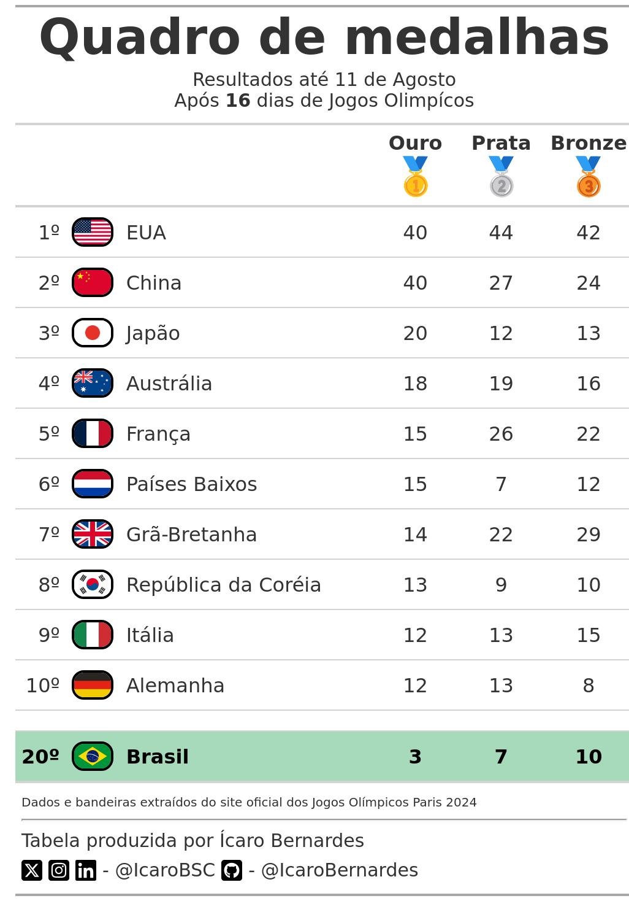

# Olimpíadas Paris 2024 ⛹🏿⛹🏻‍♀️

⏲️ Atualizado diariamente ao fim do dia, às 21H (horário de Brasília)

- **scrap.R** extrai os dados do site oficial dos jogos. Dados salvos em **data/medals.csv**;
- **limpeza.R** limpa os dados para uso em visualizações. Dados salvos em **data/medalTable.csv**;
- **tabela.R** gera a tabela com o quadro de medalhas logo após a limpeza;
- Bump plot com **trajetória** dos países (EM DESENVOLVIMENTO).

## Quadro de medalhas 🏅

